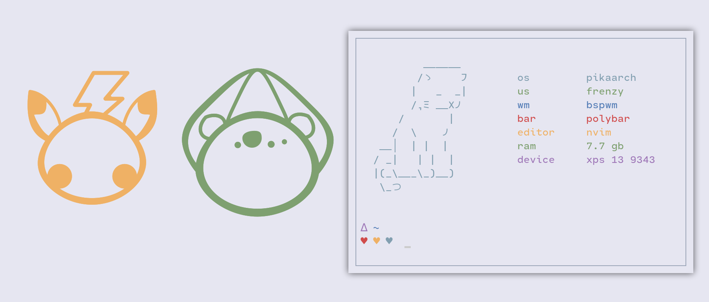
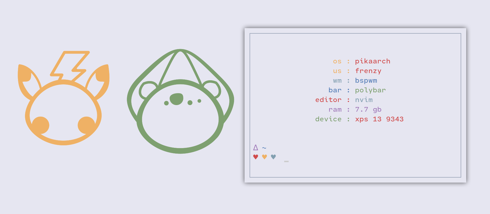

# frenzch.sh
A cozy fetch (currently super buggy)

Frenzch is able to adjust its fetch according to the size of the terminal, at the moment there's at least 2 sizes

## Full Fetch

  

## Medium Fetch

  

## Small Fetch

  

## Extra Small Fetch

  

## TODO

- [ ] fix some of the fetch info
- [x] add medium fetch
- [x] add small fetch
- [x] add extra small fetch
- [x] figure out a way to make fetch living room customizable
- [ ] clean all the crap I made because I'm bad in bash
